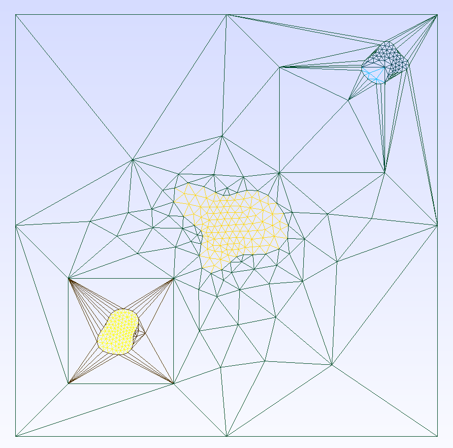

# Bubbles

With `Bubbles` you can simulate random porose materials as GMSH objects, that can be further used in FEniCS.
The porose material can be two-dimensional or three-dimensional.

## Installation

This project requires `Python 3.11`. After cloning the repository, create a virtual environment, for instance run

```bash
python3.11 -m venv .venv
source .venv/bin/activate
```


In the case you want to contribute to the code run
```bash
(.venv) $ make -B venv
```
otherwise just run
```bash
(.venv) $ pip install -e .
```

Tested with:
- macOS Ventura Version 13.3.1 with Apple M2 Chip
- Gmsh 4.11.1
- Dolfin 2019.1.0
- Python 3.11.1

## Documentation

### 2D Case
Following code snippet shows how `bubbles` can be used.

```python
from pathlib import Path
from bubbles.two_d.topology import Topology
from bubbles.two_d.hole import Stellar

domain = [(0,0), (2,2)]

sub_domains = [
    [(0.25, 0.25), (0.75, 0.75)],
    [(1.25, 1.25), (1.75, 1.75)]
]

topo = Topology(
        domain, sub_domains, periodic_boundary=True
    )

# The discretized hole has `refs` many boundary points.
stellar_hole = Stellar(midpoint=(0.5,0.5), radius=0.1)
topo.add_hole(stellar_hole, refs=30)

stellar_hole = Stellar(midpoint=(1,1), radius=0.2)
topo.add_hole(stellar_hole, refs=30)

stellar_hole = Stellar(midpoint=(1.76,1.76), radius=0.1)
topo.add_hole(stellar_hole, refs=30)

# Create and save the mesh
file_name = Path(__file__).parent.joinpath("example.msh")
topo.mesh(
    file_name=file_name,
    write_geo=True, # also saves the .GEO file
    lc=1,
    lc_subrects=1,
    filled=True, # Mesh or not the hole
)
```

### 3D Case
Needs documentation and refactorin. If you really want to use this check out the tests.

### Create Dolfin readable mesh
Once the `.GEO` file is written, following commands can be used to
create a dolfin compatible `.XML` file representing the mesh.

Write the mesh as a `.MSH` file, in the case of a 2d mesh
```bash
# For two-dimensional geometries
gmsh -2 file_path.geo -format msh2

# For three-dimensional geometries
gmsh -3 file_path.geo -format msh2
```

Convert `.MSH` file to `.XML`
```bash
dolfin-convert file_path.msh file_path.xml
```

To test if the resulting `.XML` file is a valid mesh for Dolfin try
```python
import dolfin
file_path = ... # Put the path to the .XML file here
mesh = dolfin.Mesh("file_path.xml")
dolfin.plot(mesh)
```


## Demo usage with FEniCS

Show how a domain in 2d can be created and a PDE can be solved on it using FEniCS.


Steps:
- Install Docker Desktop
- Pull the fenics docker image: ```docker pull quay.io/fenicsproject/stable:latest```
- Run the image:
    - docker run -ti -v $(pwd):/home/fenics/shared quay.io/fenicsproject/stable
    - docker run -ti quay.io/fenicsproject/stable:latest
